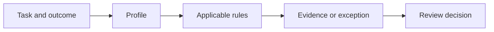

# Raintree Standards

<!-- project-record: raintree-standards -->

**Pre-1.0 open-source standards library · CC BY 4.0 and MIT**

Raintree Standards helps practitioners and agents turn a product, engineering,
security, data, content, or marketing task into testable requirements and evidence.
Use it when a checklist is too vague and a task needs explicit applicability,
verification, exceptions, and accountable review.

> [!WARNING]
> **Work in progress:** Before version 1.0, requirements and document structure can
> change. Check document status and review metadata before using a rule for release
> approval.

## Start with a task

1. Choose the closest task profile in [`profiles/`](profiles/).
2. Read every standard named by the profile’s `depends_on` field.
3. Decide which conditional rules apply to the task and its risks.
4. Collect the verification evidence required by each applicable rule.
5. Report satisfied rules, approved exceptions, and unresolved gaps by stable rule ID.



## Worked example: improve a public README

Suppose the task is “make an open-source repository easier to evaluate and install.”

| Step | Result |
| --- | --- |
| Select a route | `PROFILE-PUBLIC-WEB-PAGE` because a repository landing page is public and indexable |
| Activate writing | `PROFILE-FUNCTIONAL-WRITING` for clarity, actions, links, and reader review |
| Activate showcase rules | `MARKETING-PROJECT-SHOWCASE` for audience, lifecycle, evidence, install path, and ecosystem context |
| Collect evidence | Rendered README, working quickstart, link report, package metadata, accessibility inspection, and representative-reader notes |
| Report the outcome | Passing rule IDs, any approved exception, and unresolved evidence such as an untested screen reader |

The resulting task record connects each applicable rule to evidence instead of saying
the README “looks good.” Use the
[open-source documentation patterns](templates/open-source-documentation.md) for the
repository, package, example, evidence, or maintainer-guide structure.

## Common entry points

- [Functional writing profile](profiles/functional-writing.md)
- [Public web page profile](profiles/public-web-page.md)
- [Product feature profile](profiles/product-feature.md)
- [Agentic system profile](profiles/agentic-system.md)
- [Programmatic interface and service change profile](profiles/service-api-change.md)
- [Database change profile](profiles/database-change.md)
- [Growth experiment profile](profiles/growth-experiment.md)
- [Standards conformance audit](playbooks/standards-audit.md)
- [Complete coverage matrix](coverage.md)

## How the library works

This is a governed standards library, not a general collection of tips. Each standard
states when its rules apply, how strongly they apply, why they exist, how to verify
them, and when an exception is allowed.

Markdown is the source of truth. Governed concept documents use Open Knowledge Format
v0.2 frontmatter with a stricter Raintree application profile.

| Type | Purpose |
| --- | --- |
| Foundation | Cross-cutting constraints such as security, privacy, accessibility, reliability, trust, and evidence quality |
| Standard | Testable requirements for a domain |
| Pattern | Preferred implementation approach with known tradeoffs |
| Playbook | Ordered procedure for recurring work |
| Profile | Task-oriented bundle of applicable standards |
| Decision | Durable explanation of an important choice |

Key machine-readable surfaces:

- [`catalog.yaml`](catalog.yaml) indexes governed documents.
- [`schema/standard.schema.json`](schema/standard.schema.json) defines standard frontmatter.
- [`schema/project-showcase-record.schema.json`](schema/project-showcase-record.schema.json) defines canonical public project records.
- [`source-register.yaml`](source-register.yaml) records source owners and freshness policy.

Tools must preserve unknown frontmatter fields because Raintree does not define the
complete OKF vocabulary.

## Lifecycle and trust boundary

The OKF `status` field uses `draft`, `stable`, and `deprecated`. Raintree’s
`governance_status` uses `draft`, `active`, `deprecated`, and `retired`. A stable
document requires an independent verification event before a versioned release.

Source discovery, schema validation, migration, and author review do not count as
independent content verification. Apply only rules whose conditions are true. Record
missing evidence as a gap or unknown rather than inventing approval or conformance.

Agents may read, search, cite, and apply the library. They must not change it unless a
user explicitly assigns a standards-maintenance task. [`AGENTS.md`](AGENTS.md) defines
that boundary.

## Validate the library

```bash
ruby scripts/validate_catalog.rb
ruby scripts/validate_integrations.rb
ruby scripts/test_schema_drift.rb
ruby scripts/test_workflows.rb
ruby scripts/test_standards_lib.rb
ruby scripts/test_validate_catalog.rb
ruby scripts/test_validate_integrations.rb
ruby scripts/test_project_readme.rb
```

## Raintree open-source system

Raintree Standards defines the governed requirements, evidence, profiles, and
exceptions. Each sibling project can be used independently.

| Project | Responsibility |
| --- | --- |
| [DocPull](https://github.com/raintree-technology/docpull) | Acquires, versions, cites, and exports agent context. |
| [PolicyStrata](https://github.com/raintree-technology/policystrata) | Tests policy behavior across agent, compiler, database, and release layers. |
| [HIG Doctor](https://github.com/raintree-technology/hig-doctor) | Audits interface source and provides HIG guidance. |
| [Trellis](https://github.com/raintree-technology/trellis) | Enforces shared JavaScript and TypeScript code policy through Biome. |

See the [Raintree open-source portfolio](https://raintree.technology/portfolio#open-source)
for current lifecycle and distribution links.

## Project policies

[Contribution requirements](CONTRIBUTING.md) · [Security](SECURITY.md) ·
[Code of Conduct](CODE_OF_CONDUCT.md) · [License and attribution](LICENSE.md)

Standards and documentation use CC BY 4.0. Software, schemas, workflows, and executable
configuration use the MIT License. See [`THIRD_PARTY_NOTICES.md`](THIRD_PARTY_NOTICES.md)
for source attribution.
